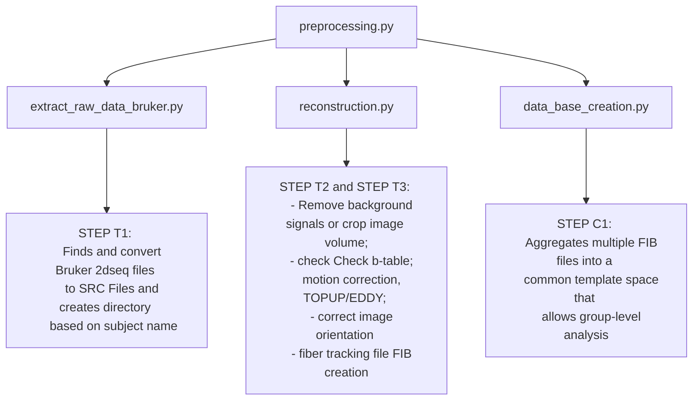

# Documentation for Correlation Tractography using DSI Studio (automatic pipline)

---

# Setup
* [Ubuntu](./doc/ubuntu_setup.md)
* [Windows](./doc/windows_setup.md)

---

# Download DSI Studio

* [Download](https://dsi-studio.labsolver.org/download.html)

---

# Main Components

**preprocessing.py**

This is the main script to execute the preprocessing workflow. During its execution, the script performs several steps to process DTI (Diffusion Tensor Imaging) data obtained from ParaVision360. The script's functionality includes finding and converting Bruker `2dseq` files into `.src` files, reconstructing the data, and creating a DSI Studio database for further statistical analysis.

# Usage Instructions