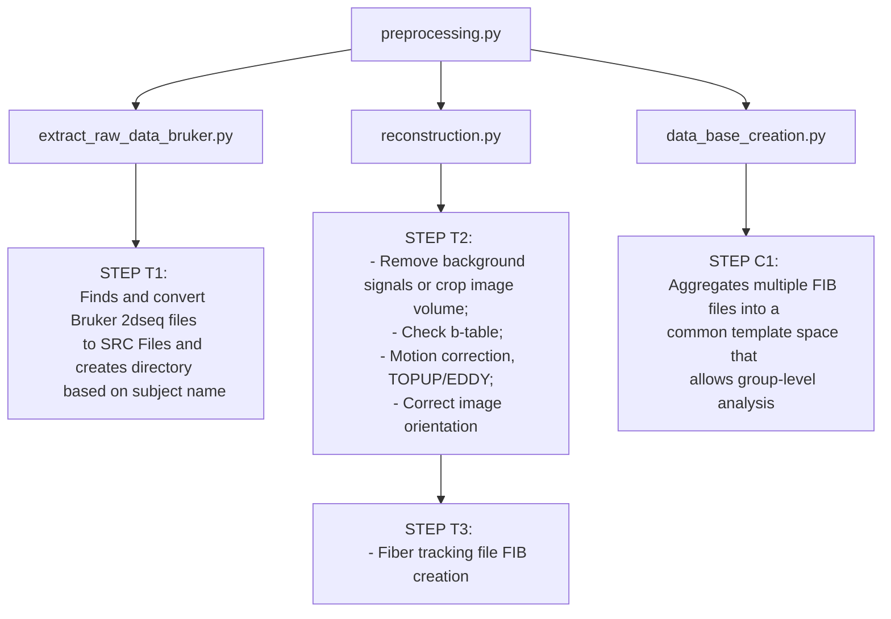
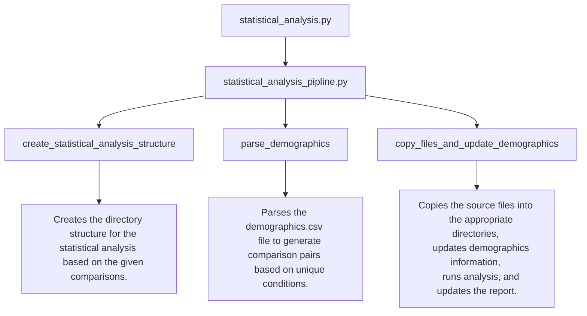

# Documentation for Correlation Tractography using DSI Studio (automatic pipline)


This is automatic pipline that allows to perform Correlation Tractography using DSI Studio from raw ParaVision360 raw data to statistical analysis.  

# Main Components

The pipeline is divided into two main components: **Preprocessing** and **Statistical Analysis**. Below is an overview of each component and the key scripts involved.

## Preprocessing 
**preprocessing.py**

This is the main script to execute the preprocessing workflow. During its execution, the script performs several steps to process DTI (Diffusion Tensor Imaging) data obtained from ParaVision360. The script's functionality includes finding and converting Bruker `2dseq` files into `.src` files, reconstructing the data, and creating a DSI Studio database for further statistical analysis.




## Statistical Analysis

**statistical_analysis.py**

This script perform the statistical analysis. It checks for the presence of required directories and files, processes the selected project, and organizes the data for statistical analysis based on demographic information.



# Usage Instructions

## Step 1: Download DSI Studio

* [Download](https://dsi-studio.labsolver.org/download.html)

## Step 2: Setup scritp & Environment
Follow the installation instructions provided for your operating system. Ensure your environment is set up correctly by following the respective setup guide:

* [Ubuntu](./doc/ubuntu_setup.md)
* [Windows](./doc/windows_setup.md)

## Step 3: Preprocessing

Before running analysis ensure that you have defined a project name and agragated ParaVision360 raw data under the input directory. The preprocessing step involves converting raw DTI data, reconstructing it, and creating a database for further analysis.

Run the Preprocessing Script:
```
python preprocessing.py
```

## Step 4: Manual Check of Database

After the preprocessing step and database creation, it's essential to manually verify the quality and accuracy of the generated data. This includes checking for any misregistration or other issues that might have occurred during preprocessing.

### Steps to Check the Database in DSI Studio:

- Open DSI Studio and navigate to the **STEP C2: View/Edit Connectometry Database**.
- Perform visual inspection of all images that were registered
- If misregistration detected please removed it and save Database again inside the same directory `data_base`.


## Step 5: Statistical Analysis

The statistical analysis step processes the selected project, organizes data, and performs analysis based on demographic information. Demographic is a file (please use this template) used to run statistical analysis based on condition. Please note that it is inportant to ensure that subject name inside the demographic file matches with names in the same order inside the Database file. If during the **Step 3: Manual Check of Database** you have detected any issues with registration and removed the subject you need to remove it from Demographic file. 


Run the Statistical Analysis Script:
```
python statistical_analysis.py
```
