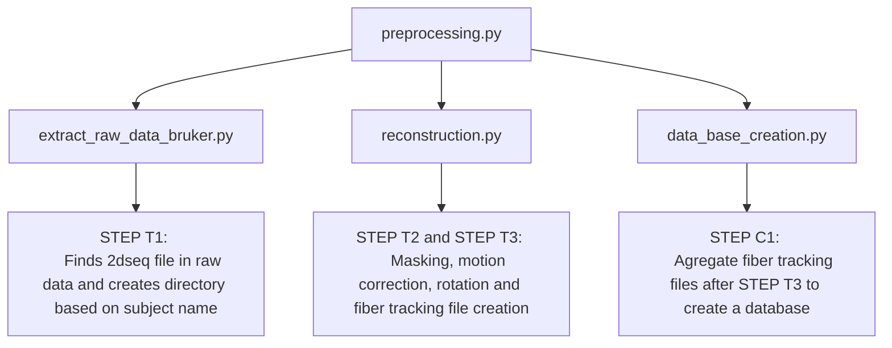

# Documentation for Correlation Tractography using DSI Studio (automatic pipline)

# Setup
* [Ubuntu](./doc/ubuntu_setup.md)
* [Windows](./doc/windows_setup.md)

Designed to process MRI raw data from ParaVision360, reconstruct files, create a DSI Studio database and perform statistical analysis

# Main Components

**preprocessing.py**

This is the main script to execute the processing workflow. Durring this script it will find respective DTI 2dseq file inside raw folder from ParaVision360 convert it to .src file reconstructing files, and creating a DSI Studio database.

# Usage Instructions